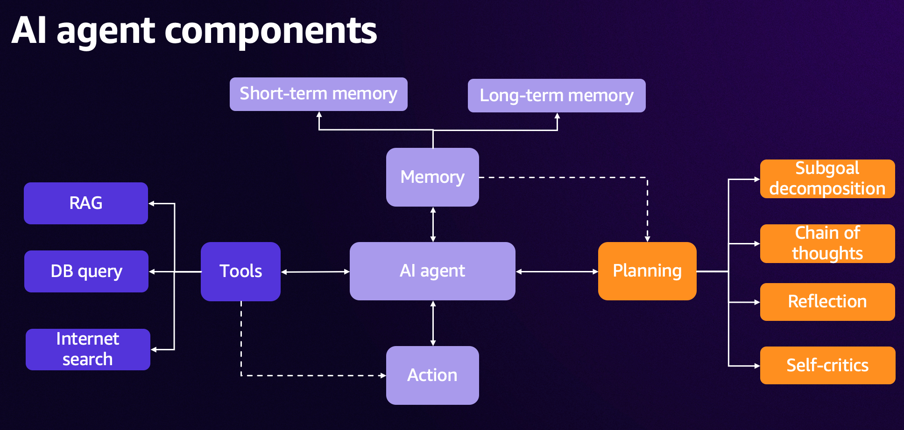
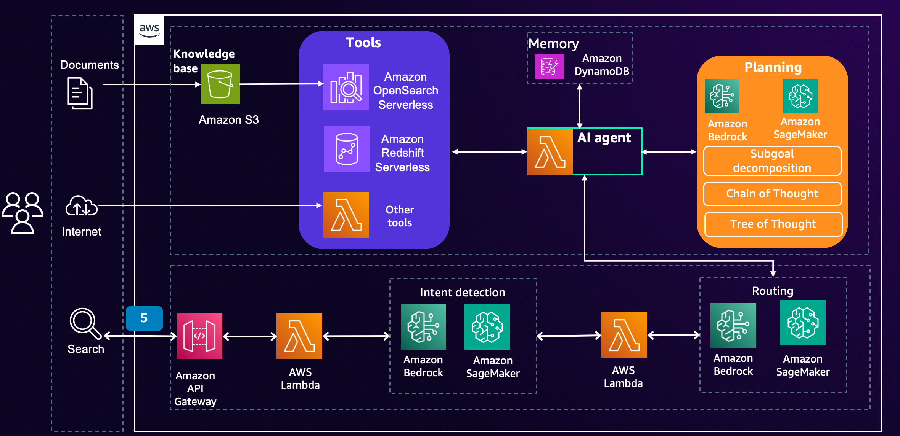

## Generative AI-powered search with Amazon OpenSearch Service

This repository guides users through creating a generative AI powered search with Amazon OpenSearch services, Amazon Bedrock.

### AI agent components

### AI agent powered search reference architecture

### CloudFormation Deployment

1. The lab can only be deployed in us-east-1 region
2. You can click the following link to deploy CloudFormation Stack
  
|   Region  |   Launch Template |
|  ---------------------------   |   -----------------------  |
|  **US East (N. Virginia)**     |  |

### Service will be used

- Amazon OpenSearch Service
- Amazon Bedrock
- Amazon Redshift
- Amazon SageMaker Notebook
- Amazon S3

## Feedback

If you have any questions or feedback, please reach us by sending email to [opensearch-gen-ai@amazon.com](mailto:opensearch-gen-ai@amazon.com).

## License

This library is licensed under the MIT-0 License. See the LICENSE file.

