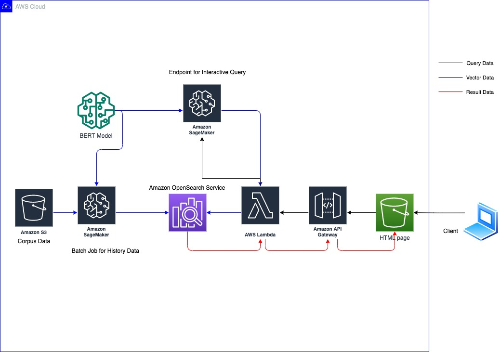
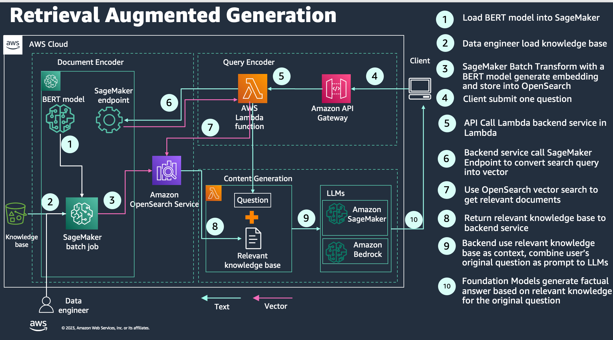
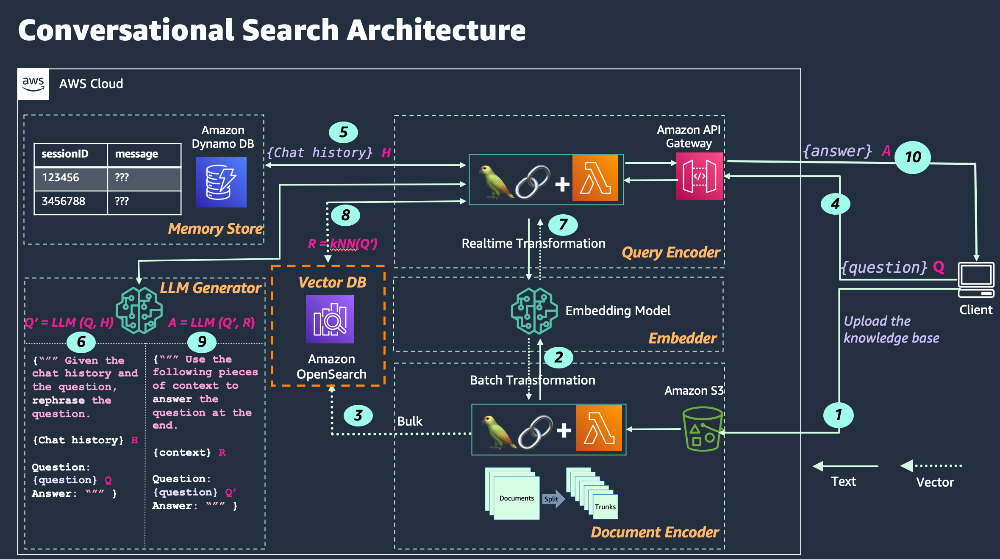

## Improve search relevance with machine learning in Amazon OpenSearch Service

This repository guides users through creating a semantic search using Amazon SageMaker and Amazon OpenSearch services

## How does it work?

This code repository is for [Semantic and Vector Search with Amazon OpenSearch Service Workshop](https://catalog.workshops.aws/semantic-search/en-US). For more information about semantic search, please refer the workshop content.

### Semantic Search Architecture

### Retrieval Augmented Generation Architecture

### Conversational Search Architecture

### CloudFormation Deployment

1. The workshop can only be deployed in us-east-1 region
2. Use the Cloudformation template `cfn/semantic-search.yaml` to create CF stack
3. Cloudformation stack name must be `semantic-search` as we use this stack name in our lab
4. You can click the following link to deploy CloudFormation Stack
  
|   Region  |   Launch Template |
|  ---------------------------   |   -----------------------  |
|  **US East (N. Virginia)**     |  |

### Lab Instruction
There are 9 modules in this workshop:
* **Module 1 - Search basics**: You will learn fundamentals of text search and semantic search. This section also introduces differences between a best matching algorithm, popularly known as BM25 similarity and semantic similarity.

* **Module 2 -Text search**: You will learn text search with Amazon OpenSearch Service. In information retrieval this type of searching is traditionally called 'Keyword' search.

* **Module 3 - Semantic search**: You will learn semantic search with Amazon OpenSearch Service and Amazon SageMaker. You will use a machine learning technique called Bidirectional Encoder Representations from transformers, popularly known as BERT. BERT uses a pre-trained natural language processing (NLP) model that represents text in the form numbers or in other words, vectors. You will learn to use vectors with kNN feature in Amazon OpenSearch Service.

* **Module 4 - Fullstack semantic search**: You will bring together all the concepts learnt earlier with a user interface that shows the advantages of using semantic search with text search. You will be using Amazon OpenSearch Service, Amazon SageMaker, AWS Lambda, Amazon API Gateway and Amazon S3 for this purpose.

* **Module 5 - Fine-tuning semantic search**: Large language models like BERT show better results when they are trained in-domain, which means fine-tuning the general model to fit ones particular business requirements in the domain of its application. You will learn how to fine tune the model for semantic search with the chosen data set.

* **Module 6 - Neural Search**: Implement semantic search with [OpenSearch Neural Search Plugin](https://opensearch.org/docs/latest/search-plugins/neural-search/).

* **Module 7 - Retrieval Augmented Generation**: Use semantic search result as context, combine the user input and context as prompt for large language models to generate factual content for knowledge intensive applications.

* **Module 8 - Conversational Search**: Search with history context while leveraging RAG.

* **Module 9 - QA over Your Knowledge Base**: End to end demo on how to implement conversational search over your knowledge base. 

Please refer [Semantic Search Workshop](https://catalog.workshops.aws/semantic-search/en-US) for lab instruction.

### Note
In this workshop, we use OpenSearch internal database to store username and password to simplify the lab. However, in production env, you should design your security solution per your requirements. For more information , please refer [Fine-grained access control](https://docs.aws.amazon.com/opensearch-service/latest/developerguide/fgac.html) and [Identity and Access Management](https://docs.aws.amazon.com/opensearch-service/latest/developerguide/ac.html).

## Feedback

If you have any questions or feedback, please reach us by sending email to [semantic-search@amazon.com](mailto:semantic-search@amazon.com).

## License

This library is licensed under the MIT-0 License. See the LICENSE file.

