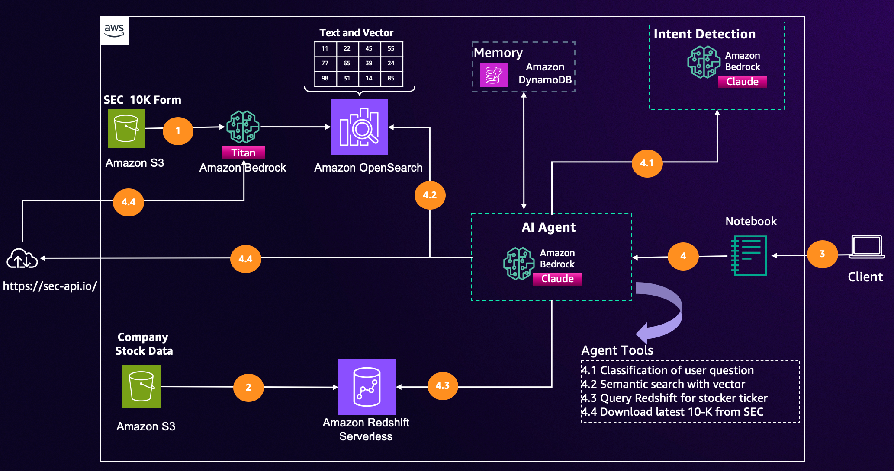

## Improve search relevance with machine learning in Amazon OpenSearch Service

This repository guides users through creating a generative AI powered search with Amazon OpenSearch services, Amazon Bedrock, Amazon Redshift.

### Generative AI powered s earch architecture

The data flow is like following:

## Feedback

If you have any questions or feedback, please reach us by sending email to [semantic-search@amazon.com](mailto:semantic-search@amazon.com).

## License

This library is licensed under the MIT-0 License. See the LICENSE file.

